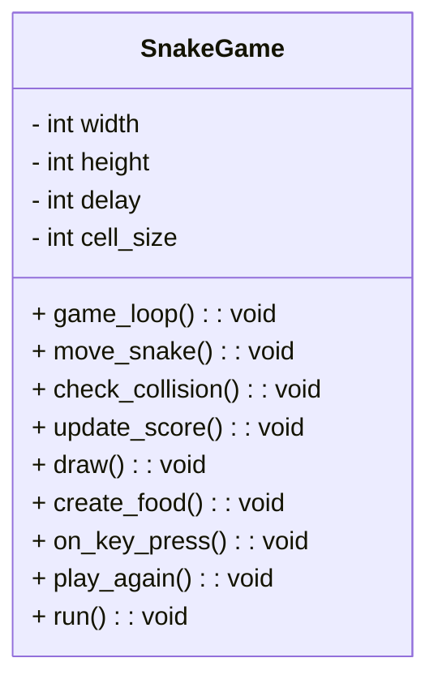

# snAIke Idee
Die Idee wäre es hier erst ein Snake Spiel zu programmieren, dann die Inputs und outputs richtig ausgeben zu lassen, und abschließend damit eine KI zu trainieren. Dabei will ich erstmal mit dem einfachst möglichen Szenario anfangen(Python und kleine KI) und dann kompliziertere Konzepte ausprobieren (limitierte Wahrnehmung), Weltsimulation seperieren und dabei Vorhersage mit einbinden. 
# ToDo 1
- Klassendiagram_01 erstellen
- Spiel programmieren
- Inputfunktion und Outputfunktion global machen
    - mit 2. dokument testen
- Videos und Papers zu Reinforcement learning schauen
- KI_01 programmieren
- KI_01 trainieren
- KI_01 testen
# Klassendiagram_01


```mermaid
classDiagram
    class SnakeGame{
        - WIDTH
        - HEIGHT
        - DELAY
        - CELL_SIZE
        - window
        - canvas
        - food_count
        - autonomy
        - snake
        - food_list
        - score
        - move
        - direction
        - reward
        - game_id
        - game_over
        + __init__(self, autonomy=False, food_count=1)
        + game_loop(self)
        + move_snake(self)
        + check_food_collision(self, new_head)
        + check_collision(self)
        + update_score(self)
        + draw(self)
        + create_food_list(self)
        + create_food(self)
        + on_key_press(self, event)
        + play_again(self)
        + run(self)
    }
class AI{
    - input_size
    - hidden1_size
    - hidden2_size
    - hidden3_size
    - output_size
    - weights_file_prefix
    - weights_input_hidden1
    - weights_hidden1_hidden2
    - weights_hidden2_hidden3
    - weights_hidden3_output
    - bias_hidden1
    - bias_hidden2
    - bias_hidden3
    - bias_output
    + __init__(self, input_size=20*20, hidden1_size=64, hidden2_size=32, hidden3_size=16, output_size=3, weights_file_prefix="neural_net_weights")
    + save_weights_bias(self, file_prefix="neural_net_weights")
    + load_weights_bias(self, file_prefix="neural_net_weights")
    + sigmoid(self, x)
    + sigmoid_derivative(self, x)
    + relu(self, x)
    + relu_derivative(self, x)
    + train(self, input_data, output_data, reward=0, learning_rate=0.01, epochs=1000)
    + predict(self, input_data, threshold=0.5)
}
class AI_IO{
    - ai_direction
    - recent_matrix_index
    - matrix
    - move
    - recent_move_index
    - last_reward
  
    + update_matrix(self, snake, food_list)
    + get_move(self)
    + ai_to_snake_direction(self, direction)
    + snake_to_ai_direction(self, direction, last_move)
    + punich(self)
    + reward_food(self)
    + predict(self)
    + train(self, train_whole_db=False)
    + train_one_state(self, entire_state)
}

class DB_IO{
    - db_name
    + __init__(self, db_name="snake_game.db")
    + save_state(self, snake, food, direction, move, reward, game_id, db_name="snake_game.db")
    + direction_vektor_to_number(self, direction_vektor)
    + number_to_direction_vektor(self, number)
    + get_last_game_id(self, db_name="snake_game.db")
    + get_last_state_id(self, db_name="snake_game.db")
    + get_state(self, state_id, db_name="snake_game.db")
}
``````

# Ablauf
move_snake() --> check_collision() --> update_score() --> draw()
## Änderungen
move_snake(vektor) --> check_collision() --> update_score() --> draw() --> update_ai(score, matrix) --> inference_ai(matrix) --> repeat
### move_snake()
Muss mithilfe von einem 3x1 Vektor bedienbar werden.
### return_score()
Soll den aktuellen Score ausgeben.
### return_matrix
Soll das Spielfeld als Matrix ausgeben.

